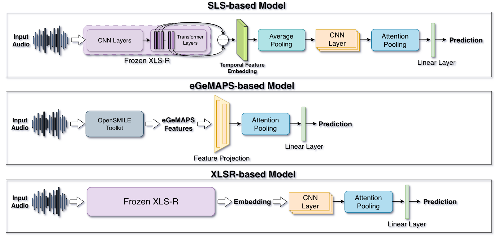

# Back to the Original Pitt Corpus: The Hidden Cost of Speech-Enhanced Datasets for Alzheimer's Detection

Systematic study of how speech enhancement and dataset filtering affect Alzheimer's disease (AD) detection from spontaneous speech. We compare the raw Pitt-origin corpus against four processed variants (Pitt, ADReSS, ADReSSo, ADReSS-M) using three deep learning models and five audio-LLMs, with Lu as the cross-domain test set.

**Key finding:** Speech enhancement and sample filtering help in-domain metrics but hurt cross-domain generalization and shift LLM decision boundaries. Unprocessed Pitt-origin is the better training set for real-world AD speech detection.

## Layout

- `ad_detection/`
  - `train/` — three deep-learning models (`SLS_Model/`, `XLSR_model/`, `eGeMAPS_model/`), each with `config.py` / `extract_feature.py` / `model.py` / `train.py` / `test.py`; shared helpers in `utils/`.
  - `train_notebook/`
    - `SLS/` — training and testing notebooks for the SLS-based model.
    - `XLSR/` — training and testing notebooks for the XLSR-based model.
    - `eGeMAPS/` — training and testing notebooks for the eGeMAPS-based model.
    - `LLM/` — Zero-shot / two-shot audio-only evaluation of Kimi-Audio, Qwen2-Audio, Qwen3-Omni, Audio Flamingo 3, Ultravox.  Audio-only and audio+transcript evaluation for Limi-Audio
  - `data/` — dataset layout (raw / denoised / processed / transcripts). See `ad_detection/data/README.md`.
  - `models/` — checkpoints. See `ad_detection/models/Readme.md`.
- `requirements/` — `model_env/deep-requirements.txt` for the three deep models; `LLMs_env/` has a separate env per LLM.

## Datasets

| Name        | Processing                                        | Source                          |
|-------------|---------------------------------------------------|---------------------------------|
| Pitt-origin | Raw data                                          | [DementiaBank — Pitt-origin](https://talkbank.org/dementia/access/English/Pitt-orig.html) |
| Pitt        | Derived from Pitt-origin (denoised)               | [DementiaBank — Pitt](https://talkbank.org/dementia/access/English/Pitt.html)             |
| ADReSS      | Derived from Pitt-origin (filtered + enhanced)    | [DementiaBank — ADReSS (2020)](https://talkbank.org/dementia/ADReSS-2020/)            |
| ADReSSo     | Derived from Pitt-origin (filtered + enhanced)    | [DementiaBank — ADReSSo (2021)](https://talkbank.org/dementia/ADReSSo-2021/index.html) |
| ADReSS-M    | Derived from Pitt-origin (filtered, not enhanced) | [DementiaBank — ADReSS-M (2023)](https://luzs.gitlab.io/madress-2023/) |
| Lu          | Raw data (distinct from Pitt-origin)              | [DementiaBank — Lu](https://talkbank.org/dementia/access/English/Lu.html)             |

All datasets from [DementiaBank](https://dementia.talkbank.org/). All the datasets use the "Cookie Theft" picture description task.

| Dataset     | Total | AD  | Control |
|-------------|:-----:|:---:|:-------:|
| Pitt-origin |  552  | 309 |   243   |
| Pitt        |  551  | 309 |   242   |
| ADReSS      |  156  |  78 |    78   |
| ADReSSo     |  237  | 122 |   115   |
| ADReSS-M    |  237  | 122 |   115   |

*Sample numbers of datasets.*

| Dataset     | Min(s) | Max(s) | Mean(s) | Median(s) | Total(min) |
|-------------|:------:|:------:|:-------:|:---------:|:----------:|
| Pitt Corpus | 18.00  | 268.48 |  70.06  |   63.29   |   643.39   |
| Pitt-origin | 17.89  | 268.49 |  69.97  |   63.20   |   643.72   |
| ADReSS      | 26.06  | 268.49 |  75.30  |   70.05   |   195.78   |
| ADReSSo     | 22.35  | 268.49 |  76.89  |   70.47   |   303.72   |
| ADReSS-M    | 22.35  | 268.49 |  76.89  |   70.48   |   303.72   |

*Audio duration statistics per dataset.*

## Alzheimer's Dementia Recognition through Spontaneous Speech Challenges

The ADReSS / ADReSSo / ADReSS-M datasets were each released as part of a corresponding challenge:

- [ADReSS Challenge](https://luzs.gitlab.io/adress/) — Interspeech 2020.
- [ADReSSo Challenge](https://luzs.gitlab.io/adresso-2021/) — Interspeech 2021.
- [ADReSS-M Challenge](https://luzs.gitlab.io/madress-2023/) — ICASSP 2023.

## Model Architectures



### **SLS-based Model.** 

The model uses `Sensitive Layer Selection (SLS)` on cached multi-layer `XLS-R` representations. Given frame-level representations from all transformer layers, the model first applies mask-aware mean pooling over time for each layer and predicts layer-wise weights through a linear layer followed by a sigmoid function. The original frame-level features are then aggregated across layers using the learned weights to obtain a weighted speech representation. This representation is passed through an classification head, including batch normalization, temporal average pooling, a one-dimensional convolutional layer, and attention pooling. Finally, a linear classification layer outputs the binary prediction.

### **XLSR-based Model.**

The audio input is first fed into a pre-trained `XLS-R` model with frozen parameters to extract frame-level speech embeddings. The extracted features are then passed through a classification head similar to that of the SLS-based model, including batch normalization, a one-dimensional convolutional layer, and attention pooling, but without temporal average pooling. During attention pooling, a padding mask is applied to prevent padded frames from interfering with the results. Finally, a linear classification layer outputs the binary prediction.

### **eGeMAPS-based Model.**

The model takes 25-dimensional `eGeMAPS` acoustic features extracted using the `OpenSMILE toolkit` as input. The features are first processed by two linear layers with batch normalization, ReLU activation, and dropout to remap the feature dimensions from 25 to 64 and then to 32. An attention pooling layer is then applied along the temporal dimension to aggregate frame-level representations into a fixed-dimensional vector. Finally, a linear classification layer outputs the AD prediction.


## Frozen pretrained backbone

XLS-R-53 (300M), used as a frozen feature extractor in the SLS-based and XLSR-based models. 

Download `xlsr2_300m.pt` From: <https://huggingface.co/facebook/wav2vec2-xls-r-300m> and place it under `ad_detection/models/`.

XLS-R requires `fairseq` (only in the `deep` env). After installing `deep-requirements.txt`, install `fairseq` in the `deep` env:

```bash
pip install -e ad_detection/train/fairseq-a54021305d6b3c4c5959ac9395135f63202db8f1
```

## Requirements

Create one conda env per requirements file. All three deep learning-base models use the same `deep` environment. Each LLM uses its own env to avoid dependency conflicts.

- `requirements/model_env/deep-requirements.txt` — env `deep`, used by all three deep-learning models (SLS, XLSR, eGeMAPS).
- `requirements/LLMs_env/kimi-requirements.txt` — env for Kimi-Audio.
- `requirements/LLMs_env/qwen-requirements.txt` — env for Qwen2-Audio and Qwen3-Omni.
- `requirements/LLMs_env/audio-flamingo3-requirements.txt` — env for Audio Flamingo 3.
- `requirements/LLMs_env/ultravox-requirements.txt` — env for Ultravox.

## Acknowledgements

This project builds on the following open-source repositories. We thank the authors for releasing their code and models.

1. OpenSMILE: https://github.com/audeering/opensmile
2. SLS: https://github.com/QiShanZhang/SLSforASVspoof-2021-DF
3. Denoiser: https://github.com/facebookresearch/denoiser
4. ClearerVoice-Studio (MossFormer, FRCRN_SE): https://github.com/modelscope/ClearerVoice-Studio
5. Kimi-Audio: https://github.com/MoonshotAI/Kimi-Audio
6. Qwen2-Audio: https://github.com/QwenLM/Qwen2-Audio
7. Qwen3-Omni: https://github.com/QwenLM/Qwen3-Omni
8. Audio Flamingo 3: https://github.com/NVIDIA/audio-flamingo
9. Ultravox: https://github.com/fixie-ai/ultravox